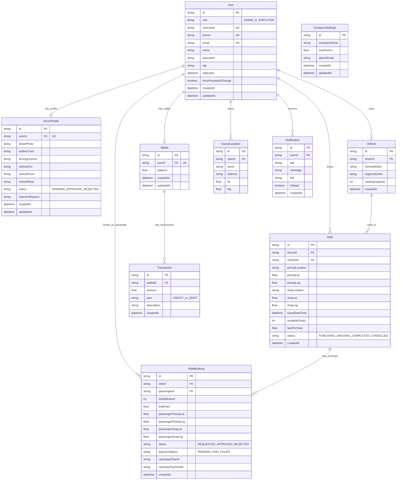

# 🚗 Carpooling Platform

A full-stack, real-time employee carpooling platform built with **Next.js 16**, **Socket.IO**, **Prisma ORM**, and **Leaflet Maps**. The platform enables employees within an organization to offer and find shared rides, manage bookings, process payments via wallet, and be administered through a dedicated admin panel.

---

## 📋 Table of Contents

- [Tech Stack](#tech-stack)
- [Architecture Overview](#architecture-overview)
- [Features](#features)
  - [Authentication & User Management](#authentication--user-management)
  - [Employee Dashboard](#employee-dashboard)
  - [Driver — Offer a Ride](#driver--offer-a-ride)
  - [Passenger — Find a Ride](#passenger--find-a-ride)
  - [Booking Lifecycle](#booking-lifecycle)
  - [Payment & Wallet System](#payment--wallet-system)
  - [Real-Time System (WebSockets)](#real-time-system-websockets)
  - [Interactive Maps](#interactive-maps)
  - [Notifications](#notifications)
  - [Admin Panel](#admin-panel)
- [Database Schema](#database-schema)
- [Project Structure](#project-structure)
- [Environment Variables](#environment-variables)
- [Getting Started](#getting-started)
- [Key Technical Decisions](#key-technical-decisions)

---

## 🛠️ Tech Stack

| Layer | Technology |
|---|---|
| **Framework** | Next.js 16.2.6 (App Router) |
| **Language** | TypeScript 5 |
| **Runtime Server** | Custom Node.js HTTP server (`tsx`) |
| **Real-Time** | Socket.IO 4.8 (Server + Client) |
| **ORM** | Prisma 5.22 with SQLite |
| **UI Components** | Shadcn/UI + Radix UI Primitives |
| **Styling** | Tailwind CSS v4 |
| **Maps** | Leaflet + React-Leaflet (OpenStreetMap tiles) |
| **Geocoding** | Nominatim (OpenStreetMap reverse geocoding API) |
| **Authentication** | Cookie-based sessions + bcryptjs password hashing |
| **Payments** | Razorpay (order creation + payment verification) |
| **Email** | Nodemailer (SMTP, with console mock for dev) |
| **Validation** | Zod |
| **Icons** | Lucide React |
| **Toasts** | Sonner |
| **Theming** | next-themes (light/dark mode) |

---

## 🏗️ Architecture Overview

```
┌─────────────────────────────────────────────────────────────────┐
│                         Custom Node.js Server                    │
│  ┌─────────────────────────────┐  ┌───────────────────────────┐  │
│  │     Next.js App Router      │  │    Socket.IO Server       │  │
│  │  (SSR + Server Actions)     │  │  (Real-Time WebSockets)   │  │
│  └─────────────────────────────┘  └───────────────────────────┘  │
│                    ↕                             ↕                │
│  ┌────────────────────────────────────────────────────────────┐  │
│  │                    Prisma ORM + SQLite DB                  │  │
│  └────────────────────────────────────────────────────────────┘  │
└─────────────────────────────────────────────────────────────────┘
          ↕                                   ↕
┌──────────────────┐                ┌──────────────────────────┐
│  Browser Client  │                │  External APIs           │
│  React 19        │                │  - OpenStreetMap/Nominatim│
│  useSocket hook  │                │  - Razorpay Gateway      │
│  Leaflet Maps    │                │  - SMTP (Nodemailer)     │
└──────────────────┘                └──────────────────────────┘
```

The server (`server/index.ts`) wraps the Next.js request handler inside a standard Node.js `http.createServer`, then attaches the Socket.IO server to the **same HTTP server instance**. This eliminates cross-origin issues and means the WebSocket connection shares port 3000 with the web app.

---

## ✨ Features

### Authentication & User Management

- **Cookie-based sessions** — On login, the user's `id` is stored in an `httpOnly` cookie (`session_user_id`). All protected pages read this cookie server-side via `getCurrentUserAction()`.
- **Next.js Middleware** — `middleware.ts` guards `/offer-ride`, `/find-ride`, `/employee`, and `/admin` routes, redirecting unauthenticated users to `/auth/signin`. It also redirects already-authenticated users away from auth pages.
- **bcryptjs password hashing** — All passwords are hashed with a salt factor of 10 before being stored.
- **Zod validation** — Registration form data is validated server-side with a strict Zod schema (email format, minimum lengths, etc.).
- **Force password change** — When an admin creates an employee, a `forcePasswordChange` flag is set. On the user's next login, they are immediately prompted to set a new password before accessing the app.
- **OTP-based password reset** — Users can request a password reset via email. A 6-digit OTP is generated, stored in the database with a 10-minute expiry, and sent via email. The OTP is verified before allowing a password change.
- **Duplicate-check registration** — The registration action queries for conflicts on email, username, and phone simultaneously before creating a user.
- **Role detection** — A user is automatically assigned the `ADMIN` role if their chosen username contains the string `"admin"`; otherwise, they are assigned `EMPLOYEE`.

---

### Employee Dashboard

The main employee portal (`/employee`) provides:

- **Stats Overview** — Total rides taken, total rides offered, wallet balance, and notification count — all fetched server-side in a single page render.
- **Ride History** (`/employee/history`) — A full log of all bookings made as a passenger, including the booking status (REQUESTED, APPROVED, REJECTED, COMPLETED, CANCELLED) and payment status (PENDING, PAID).
- **Reports** (`/employee/reports`) — Summary reporting view for personal activity.
- **Settings** (`/employee/settings`) — Allows the employee to update their profile information and manage saved locations.
- **Driver Onboarding** — Employees can apply to become a driver from the settings page by submitting their driver profile with document uploads.
- **Saved Locations** — Users can save named locations (e.g., "Home", "Office") that appear as quick-select chips on the ride search and offer forms.

---

### Driver — Offer a Ride

Located at `/offer-ride`, this flow allows an approved driver to publish a ride for others to find.

**Prerequisite:** The user's `DriverProfile` must have a `status` of `APPROVED` by an admin. This is enforced server-side in `publishRideAction`.

**Flow:**
1. Driver selects pickup and drop-off coordinates using the interactive Leaflet map (click to pin or text search via Nominatim geocoding).
2. Driver sets travel date/time, number of available seats, and fare per seat.
3. On submission, `publishRideAction` runs server-side:
   - Auto-provisions a `Vehicle` record if the driver doesn't already have one (for demo convenience).
   - Creates the `Ride` record with status `PUBLISHED` in the database.
   - Creates a `Notification` for every other user in the system announcing the new ride.
   - Returns the full ride object to the client.
4. The client then emits a `new_ride_published` event over the WebSocket, which the server relays to everyone in the `search_room`.

**Driver Dashboard** (`/offer-ride`) also shows:
- All rides published by the driver.
- All incoming `REQUESTED` bookings per ride, with Approve / Reject actions.
- A "Complete Ride" button to finalize a ride and trigger wallet earnings credit.

---

### Passenger — Find a Ride

Located at `/find-ride`, this flow allows any employee to search for available rides.

**Search Algorithm (`searchRidesAction`):**
1. Fetches all `Ride` records from the database with `status: "PUBLISHED"` and `availableSeats > 0`.
2. For each ride, calculates two distances using the **Haversine formula** (great-circle distance):
   - `pickupDist`: distance from passenger's chosen pickup point to the driver's pickup point.
   - `dropDist`: distance from passenger's chosen drop-off to the driver's drop-off point.
3. Filters to rides where **both** distances are within the configured `radiusKm` (default: **5 km**).
4. Excludes the current user's own rides.
5. Sorts results by `pickupDist + dropDist` (closest combined route match first).

**UI Features:**
- Dual-panel layout: search form + results on the left, interactive map on the right.
- Location input via text search (Nominatim) or direct map pin click (with reverse geocoding).
- Seat count selector (1–4 seats).
- Real-time ride injection via WebSocket: if a new ride is published while the user is searching, the Haversine check runs client-side and the ride is prepended to the results if it matches.
- Saved location chips for quick pickup/drop selection.

---

### Booking Lifecycle

The booking system follows a formal state machine:

```
[REQUESTED] → [APPROVED] → [COMPLETED]
     ↓              ↓
[REJECTED]    [CANCELLED]
```

- **REQUESTED**: Passenger clicks "Request Seat". `requestBookingAction` creates a `RideBooking` with status `REQUESTED`. A notification is created for the driver. The passenger is redirected to their ride history.
- **APPROVED**: Driver clicks "Approve" on the booking request. `approveBookingAction` updates the booking to `APPROVED`, decrements `availableSeats` on the ride, and sets the ride `status` to `ONGOING`. A notification is sent to the passenger.
- **REJECTED**: Driver clicks "Reject". `rejectBookingAction` updates booking to `REJECTED`, sends a notification to the passenger.
- **CANCELLED**: Passenger cancels a `REQUESTED` or `APPROVED` booking. If the booking was `APPROVED`, the seats are restored via increment.
- **COMPLETED**: When the driver clicks "Complete Ride", `completeRideAction` runs in a database transaction: it sets the ride to `COMPLETED`, marks all approved bookings as `COMPLETED`, sums all `PAID` fares, and credits the total to the driver's wallet.

All state transitions emit WebSocket events to notify the relevant party in real time.

---

### Payment & Wallet System

**Wallet Model:**
- Every user has a single `Wallet` with a `balance` (Float).
- All credits and debits are logged in a `Transaction` table with a type (`CREDIT` / `DEBIT`) and description.

**Wallet Top-Up (Add Money):**
1. A Razorpay order is created via the `/api/create-order` API route, returning an order ID and amount.
2. The Razorpay checkout is launched client-side with the order details.
3. On successful payment, `/api/verify-payment` is called. The server updates the booking's `paymentStatus` to `PAID` and stores the `razorpayOrderId` / `razorpayPaymentId`.

**Wallet Withdrawal:**
- Employees can withdraw funds from their wallet via the `WithdrawButton` component, subject to sufficient balance validation.

**Driver Earnings:**
- When `completeRideAction` is called, the server sums the `totalFare` of all `APPROVED` + `PAID` bookings and credits the driver's wallet in the same database transaction.

---

### Real-Time System (WebSockets)

Powered by **Socket.IO 4**, the WebSocket layer is mounted on the same HTTP port as Next.js. Client connections are managed by the `useSocket` hook (`hooks/use-socket.ts`), which ensures a single shared socket instance per browser window via `window.__socketInstance`.

**Room Architecture:**

| Room | Join Trigger | Purpose |
|---|---|---|
| `{userId}` | On every connection + `join_user` event | Private targeted messages to a specific user (notifications, booking updates, chat) |
| `search_room` | When passenger opens Find Ride page (`join_search_room`) | Broadcast new published rides to all searching passengers |
| `ride:{rideId}` | When driver/passenger opens an active ride (`join_ride_room`) | Real-time GPS location updates and ride completion events |

**Events:**

| Event (Client → Server) | Description |
|---|---|
| `join_user` | Joins the user's personal room |
| `join_search_room` | Joins the global ride search room |
| `join_ride_room` | Joins a specific ride's tracking room |
| `new_ride_published` | Broadcasts a new ride to all searchers |
| `booking_requested` | Relays a new booking request to the driver's room |
| `booking_updated` | Relays approve/reject status to the passenger's room |
| `cancel_booking` | Relays a cancellation event to the driver |
| `update_ride_location` | Driver streams GPS coordinates to the ride room |
| `complete_ride` | Broadcasts ride completion to all passengers in the room |
| `send_chat_message` | Delivers a 1-to-1 chat message to a specific user |

---

### Interactive Maps

Built with **Leaflet** and **React-Leaflet**, rendered client-side only via a `DynamicMap` wrapper that uses `next/dynamic` with `ssr: false` to prevent hydration errors.

**Features:**
- OpenStreetMap tile layer (free, no API key required).
- Custom SVG `divIcon` markers for pickup (green) and drop-off (blue).
- Route visualization with a `Polyline` drawn between pickup and drop-off.
- Auto-bounds fitting: when both points are set, the map calls `fitBounds` with 50px padding to frame both markers.
- **Click-to-pin mode**: When "Pin on Map" is active, the cursor changes to a custom crosshair map-pin SVG. A click emits the `lat`/`lng` to the parent, which then calls the Nominatim reverse geocoding API to resolve an address.
- **Full-screen toggle**: A button overlays the map to expand it to fill the entire viewport (`fixed inset-0 z-50`).
- Default map center is set to **Ahmedabad, Gujarat** (23.0225°N, 72.5714°E).

**Geocoding (Location Search):**
- The `LocationSearch` component uses the **Nominatim Search API** (`https://nominatim.openstreetmap.org/search`) to provide autocomplete suggestions.
- Reverse geocoding (for map-click-to-address) uses `https://nominatim.openstreetmap.org/reverse`.

---

### Notifications

- Each `Notification` record stores a `userId`, `title`, `message`, `link` (optional navigation URL), and `isRead` flag.
- The `NotificationBell` component in the header shows an unread count badge.
- Clicking a notification navigates to its `link` and marks it as read.
- Real-time delivery: The WebSocket server emits `new_notification` to the target user's personal room whenever a relevant event occurs (new booking, approval, rejection, driver approval).

**Notification Triggers:**
- Driver publishes a ride → all other users notified.
- Passenger requests a booking → driver notified.
- Driver approves/rejects a booking → passenger notified.
- Admin approves/rejects a driver profile → employee notified.

---

### Admin Panel

Located at `/admin`, the admin panel is fully role-guarded — all server actions verify `role === "ADMIN"` before executing.

**Sections:**

| Section | Capabilities |
|---|---|
| **Dashboard** | Overview stats for total employees, rides, bookings |
| **Employees** (`/admin/employees`) | Add, edit, delete employees. Add sends a temporary password via email with `forcePasswordChange = true`. Resend credentials re-generates a temp password. |
| **Driver Verifications** (`/admin/verifications`) | View submitted driver profiles with uploaded documents (photo, Aadhaar, driving licence, vehicle PUC, vehicle photos). Approve or reject with a reason. |
| **Vehicles** (`/admin/vehicles`) | Full CRUD for vehicle records. Add, edit, delete vehicles and assign them to drivers. |
| **Rides** (`/admin/rides`) | View all rides in the system with status. |
| **Company Settings** (`/admin/settings`) | Configure company name, cost per km, and admin email. |

**Admin Add Employee Flow:**
1. Admin submits name, email, phone.
2. A random username (email prefix + random number) and random 8-character temporary password are generated.
3. User is created with `forcePasswordChange: true`.
4. A welcome email with the temp password is sent asynchronously via Nodemailer (non-blocking — uses `.catch(console.error)` to prevent UI delay).

---

## 🗄️ Database Schema

Built with **Prisma + SQLite**. All IDs use `cuid()` for URL-safe, collision-resistant strings.



**RideBooking status flow:**

```
REQUESTED ──► APPROVED ──► COMPLETED
     │              │
     ▼              ▼
 REJECTED       CANCELLED
```

**RideBooking paymentStatus flow:**

```
PENDING ──► PAID
   │
   ▼
 FAILED
```

---

## 📁 Project Structure

```
.
├── app/
│   ├── actions/           # Next.js Server Actions (auth, ride, admin, wallet, notifications)
│   ├── admin/             # Admin panel pages (employees, verifications, vehicles, rides, settings)
│   ├── api/
│   │   ├── create-order/  # Razorpay order creation endpoint
│   │   └── verify-payment/# Razorpay payment verification endpoint
│   ├── auth/              # Sign-in / Sign-up / Password reset pages
│   ├── employee/          # Employee portal (dashboard, history, wallet, reports, settings)
│   ├── find-ride/         # Passenger ride search and bookings
│   ├── offer-ride/        # Driver ride publish and booking management
│   ├── invoice/           # Booking invoice view
│   └── ride/              # Individual ride detail/tracking page
├── components/
│   ├── admin/             # Admin-specific UI components
│   ├── auth/              # Auth form components
│   ├── layout/            # Navbar, sidebar, app shell
│   ├── map/               # Leaflet Map, DynamicMap wrapper, LocationSearch
│   ├── notifications/     # NotificationBell component
│   ├── ride/              # FindRideForm, OfferRideForm, booking cards
│   └── ui/                # Shadcn/Radix UI primitives
├── hooks/
│   └── use-socket.ts      # Singleton Socket.IO client hook
├── lib/
│   ├── db.ts              # Prisma client singleton
│   └── mailer.ts          # Nodemailer email utility
├── prisma/
│   ├── schema.prisma      # Database schema
│   └── seed.ts            # Database seeder
├── server/
│   └── index.ts           # Custom Node.js server (Next.js + Socket.IO)
└── middleware.ts           # Route protection via cookie session check
```

---

## 🔑 Environment Variables

Create a `.env` file at the root:

```env
# Database
DATABASE_URL="file:./dev.db"

# Razorpay (optional for production)
RAZORPAY_KEY_ID=your_razorpay_key_id
RAZORPAY_KEY_SECRET=your_razorpay_key_secret

# SMTP Email (optional — console-mocked if not set)
SMTP_HOST=smtp.gmail.com
SMTP_PORT=587
SMTP_USER=your_email@gmail.com
SMTP_PASS=your_app_password
SMTP_FROM="Carpooling Platform <noreply@carpool.app>"
```

---

## 🚀 Getting Started

### Prerequisites

- Node.js 18+
- npm

### Installation

```bash
# Install dependencies
npm install

# Set up the database
npx prisma migrate dev --name init

# (Optional) Seed the database with sample data
npx prisma db seed
```

### Development

```bash
npm run dev
```

The server starts at `http://localhost:3000`. Both Next.js and the Socket.IO WebSocket server run on the same port.

### Build & Production

```bash
npm run build
npm start
```

### Other Scripts

```bash
npm run lint       # ESLint
npm run format     # Prettier formatting
npm run typecheck  # TypeScript type checking (no emit)
```

---

## 🔧 Key Technical Decisions

1. **Single-server Socket.IO on same port**: Rather than running a separate WebSocket server, Socket.IO is attached to the same `http.createServer` instance as Next.js. This avoids CORS configuration and simplifies deployment.

2. **Singleton WebSocket client**: The `useSocket` hook stores the socket in `window.__socketInstance`, ensuring a single connection is shared across all React components, even when multiple components call the hook.

3. **Server Actions over API routes**: All data mutations use Next.js Server Actions (`"use server"` directive). This keeps auth logic server-side and avoids the boilerplate of API route handlers for CRUD operations.

4. **Haversine formula client + server**: The proximity matching algorithm is implemented in both the server action (for the initial search query) and the client hook (for real-time WebSocket ride filtering), ensuring consistent behavior without an additional round-trip.

5. **Dynamic map import**: The Leaflet map is wrapped in `next/dynamic` with `ssr: false` because Leaflet accesses `window` and `document` directly — objects unavailable during Next.js server-side rendering.

6. **Prisma transactions for booking state**: Critical multi-step operations (approve booking → decrement seats → notify passenger; complete ride → credit wallet → log transaction) use `prisma.$transaction` to guarantee atomicity.

7. **Non-blocking email sends**: Email sending calls use `.catch(console.error)` without `await` to ensure that SMTP failures never block the server action response.
